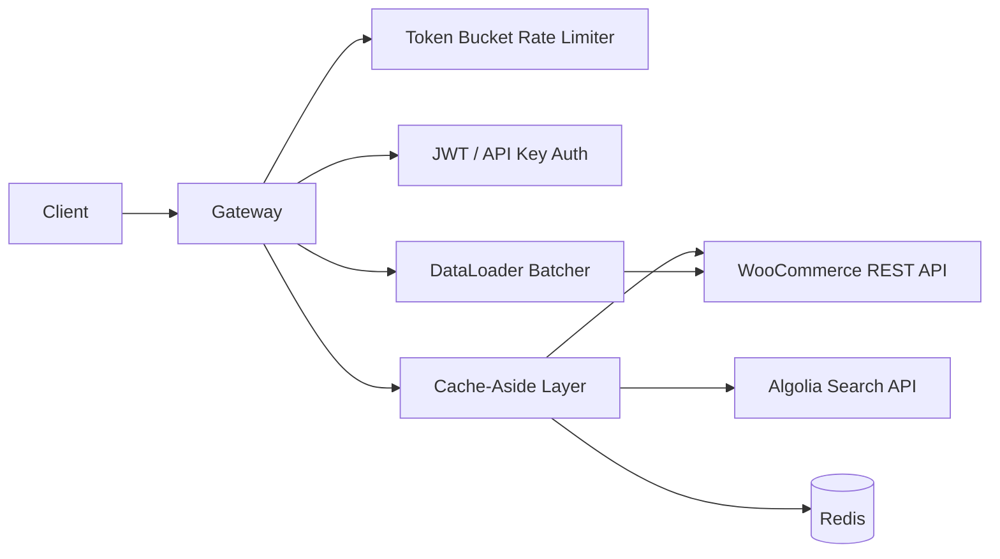

# node-api-gateway

Hono-based API gateway aggregating WooCommerce + Algolia with production-grade patterns: DataLoader N+1 prevention, circuit breaker, token bucket rate limiting, and cache-aside with stale-while-revalidate.

## Why

A headless storefront needs a backend aggregation layer that:
- Prevents N+1 queries by batching product fetches with DataLoader
- Handles downstream failures gracefully via circuit breaker
- Protects services from abuse via per-IP rate limiting
- Reduces latency via cache-aside (in-memory or Redis)

## Architecture



## Quick Start

```bash
cp .env.example .env.local   # mock mode works without external deps
pnpm install
pnpm dev
# API available at http://localhost:3001
```

## Tech Stack

| Technology | Version | Why |
|-----------|---------|-----|
| Hono | 4.12 | Lightweight, TypeScript-first, edge-ready |
| TypeScript | 6.0 | Strict end-to-end type safety |
| Node.js | 22 | LTS, native fetch, ESM |
| Redis | 7 | Cache + rate limit state in production |
| jose | 5 | JWT verification (Web Crypto API) |
| pino | 9 | Structured JSON logging |
| Zod | 3 | Runtime validation for env + requests |

## Features

- **DataLoader** (`src/lib/data-loader.ts`) — batches N product fetches into 1 API call
- **Circuit Breaker** (`src/lib/circuit-breaker.ts`) — CLOSED→OPEN→HALF_OPEN state machine
- **Token Bucket** (`src/middleware/rate-limiter.ts`) — 100 req/min per IP, Redis-backed in prod
- **Cache-Aside** (`src/middleware/cache.ts`) — 60s TTL, stale-while-revalidate
- **JWT + API Key Auth** (`src/middleware/auth.ts`) — bearer token or X-API-Key header
- **RFC 7807 Error Responses** (`src/middleware/error-handler.ts`) — Problem Details format
- **OpenAPI 3.1 Spec** (`openapi/spec.yaml`) — source of truth for all routes
- **Health + Readiness probes** (`src/routes/health.ts`) — Kubernetes-ready

## Project Structure

```
src/
├── app.ts              # App factory (middleware + routes)
├── index.ts            # Server bootstrap
├── config/env.ts       # Zod-validated env vars
├── lib/
│   ├── circuit-breaker.ts
│   ├── data-loader.ts
│   └── retry.ts
├── middleware/
│   ├── auth.ts
│   ├── cache.ts
│   ├── error-handler.ts
│   ├── rate-limiter.ts
│   └── request-id.ts
├── routes/
│   ├── cart.ts
│   ├── health.ts
│   ├── products.ts
│   └── search.ts
└── services/
    ├── algolia.service.ts
    ├── cache.service.ts
    └── woocommerce.service.ts
```

## Configuration

| Variable | Description | Required | Default |
|----------|-------------|----------|---------|
| `PORT` | Server port | No | 3001 |
| `NODE_ENV` | Environment | No | development |
| `JWT_SECRET` | JWT signing secret | Yes (prod) | — |
| `REDIS_URL` | Redis connection URL | No | in-memory |
| `WC_BASE_URL` | WooCommerce site URL | No | mock |
| `WC_KEY` | WooCommerce consumer key | No | mock |
| `WC_SECRET` | WooCommerce consumer secret | No | mock |
| `ALGOLIA_APP_ID` | Algolia app ID | No | mock |
| `ALGOLIA_API_KEY` | Algolia admin key | No | mock |
| `LOG_LEVEL` | Pino log level | No | info |

## Mock mode (offline)

```bash
pnpm dev   # uses in-memory cache, returns mock data for WC/Algolia
```

## Docker mode

```bash
docker compose up -d
# App: http://localhost:3001
# Redis: localhost:6379
```

## Testing

```bash
pnpm test          # all tests
pnpm test:unit     # unit tests only
pnpm test:coverage # with coverage report
pnpm test:ci       # CI mode (no watch, JUnit output)
```

Key test coverage:
- Circuit breaker state transitions (CLOSED→OPEN→HALF_OPEN)
- DataLoader batches 10 individual fetches into 1 API call
- Rate limiter blocks request N+1 after threshold

## API Reference

See [openapi/spec.yaml](openapi/spec.yaml) for full OpenAPI 3.1 spec.

| Method | Path | Auth | Description |
|--------|------|------|-------------|
| GET | /health | None | Liveness probe |
| GET | /ready | None | Readiness probe |
| GET | /products | Optional | List products (paginated) |
| GET | /products/:id | Optional | Single product |
| GET | /search?q= | Optional | Algolia search with facets |
| GET | /cart/:id | Required | Get cart |
| POST | /cart/:id/items | Required | Add item to cart |
| PUT | /cart/:id/items/:itemId | Required | Update quantity |
| DELETE | /cart/:id/items/:itemId | Required | Remove item |

## Performance

- DataLoader eliminates N+1: 10 product requests → 1 batched API call
- Cache-aside: avg response time drops from ~200ms to ~5ms for cached responses
- Circuit breaker: prevents cascade failures from downstream API outages

## License

MIT
